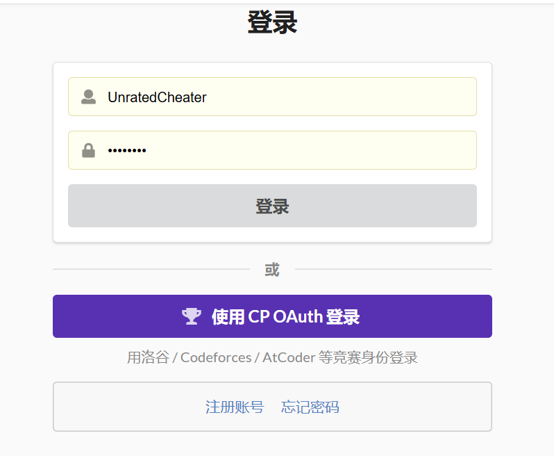
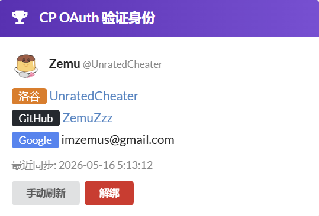

# syzoj-cpoauth-plugin

为你的 SYZOJ 添加 [CP OAuth](https://cpoauth.com) 第三方登录支持。

> 灵感来自 [imsunxinhao/login-with-cp-oauth](https://github.com/imsunxinhao/login-with-cp-oauth)(为 Hydro 开发)。本插件是面向 **SYZOJ** 的实现。

## 特性

- ✅ CP OAuth 一键登录(自动绑定 / 创建新账号)
- ✅ 已有 SYZOJ 账号通过密码确认绑定到 CP OAuth
- ✅ 个人主页展示绑定的洛谷 / Codeforces / AtCoder / GitHub UID
- ✅ 手动同步 / 解绑功能
- ✅ refresh_token 持久存储,用于后续同步
- ✅ PKCE + state CSRF 防御
- ✅ 零侵入插件式集成(零 patch、4 处 1 行 include)

## 截图

> 准备 3 张截图放进 `docs/screenshots/` 后,把下面的链接打开即可。

- 
- 
- 

## 快速开始

### 前提

- SYZOJ 已通过 docker-compose 部署并能正常运行
- 已在 [cpoauth.com](https://cpoauth.com) 注册应用,拿到 `client_id` 和 `client_secret`
- 你的 OJ 有公网域名 + HTTPS

### 安装

```bash
cd /etc/docker/compose/YourOJ        # 你的 SYZOJ docker-compose 所在目录
git clone https://github.com/<你>/syzoj-cpoauth-plugin
bash syzoj-cpoauth-plugin/scripts/install.sh
```

安装脚本会:
1. 在 SYZOJ 数据库建 `user_cpoauth_binding` 表
2. 打印你需要加到 `docker-compose.yml` 的内容
3. 提示你需要改 4 处 SYZOJ 源码(每处 1 行 include 或 1 段代码)

详细分步说明见 [docs/INSTALL.md](docs/INSTALL.md)。

### 配置

5 个环境变量(详见 [docs/CONFIG.md](docs/CONFIG.md)):

```yaml
SYZOJ_WEB_CPOAUTH_CLIENT_ID: "你的-client-id"
SYZOJ_WEB_CPOAUTH_CLIENT_SECRET: "你的-secret"
SYZOJ_WEB_CPOAUTH_BASE_URL: "https://cpoauth.com"
SYZOJ_WEB_CPOAUTH_REDIRECT_URI: "https://your-oj.example.com/auth/cpoauth/callback"
SYZOJ_WEB_CPOAUTH_SCOPE: "openid profile cp:linked"
```

### 集成现有页面

按下面 4 个文档分别在你的 SYZOJ 上加一行 include:

- **登录页**: [integration/login_integration.md](integration/login_integration.md)
- **注册页**: [integration/sign_up_integration.md](integration/sign_up_integration.md)
- **个人主页(view)**: [integration/user_view_integration.md](integration/user_view_integration.md)
- **个人主页(module)**: [integration/user_module_integration.md](integration/user_module_integration.md) ← **必须**

### 重启

```bash
docker compose up -d --force-recreate web
```

> 必须 `--force-recreate`,光 `restart` 不会重新加载新的 volume 挂载。

## 已知坑(必读)

- ⚠️ scope 必须是 `openid profile cp:linked`(带冒号),**不是** `cp_summary`
- ⚠️ /userinfo 返回字段叫 `linked_accounts`(数组),**不叫** `cp_summary`
- ⚠️ SYZOJ 密码加盐 `md5(password + 'syzoj2_xxx')`,**不是裸 md5**
- ⚠️ authorize 端点用 `/oauth/authorize`(Nuxt 页面),token / userinfo / revoke 用 `/api/oauth/*`
- ⚠️ EJS include **不带 .ejs 后缀**:`<% include _cpoauth_login_button %>`
- ⚠️ docker bind-mount 改变后必须 `--force-recreate`,光 restart 不行
- ⚠️ nginx CSP 的 `connect-src` 要加 `https://cpoauth.com`

详见 [docs/TROUBLESHOOTING.md](docs/TROUBLESHOOTING.md)。

## 架构

```
用户点登录 → /auth/cpoauth/login (PKCE + state)
            → cpoauth.com 授权页
            → 回调 /auth/cpoauth/callback
              ├─ 已绑定 → 直接登录
              ├─ 未绑定 + 已登录 → 绑定到当前账号
              └─ 未绑定 + 未登录 → /auth/cpoauth/choose 选择页
                                  ├─ 创建新 SYZOJ 账号
                                  └─ 用密码绑定现有账号
```

数据存在 `user_cpoauth_binding` 表(单表,无外键约束)。

详细架构图 + 数据模型见 [docs/ARCHITECTURE.md](docs/ARCHITECTURE.md)。

## 文件清单

```
syzoj-cpoauth-plugin/
├── README.md                              ← 本文件
├── LICENSE                                ← MIT
├── docs/
│   ├── INSTALL.md                         ← 详细安装步骤
│   ├── CONFIG.md                          ← 环境变量详解
│   ├── ARCHITECTURE.md                    ← OAuth 流程图 + 数据模型
│   ├── TROUBLESHOOTING.md                 ← 已知坑
│   └── screenshots/                       ← 截图(用户自行补充)
├── sql/
│   └── 001_create_binding_table.sql       ← 建表 SQL
├── plugin/                                ← 直接挂载到容器
│   ├── modules/cpoauth.js                 ← 主后端(7 个路由)
│   └── views/
│       ├── cpoauth_choose.ejs             ← 选择页
│       ├── _cpoauth_login_button.ejs      ← 可复用按钮 partial
│       └── _cpoauth_profile_card.ejs      ← 可复用资料卡片 partial
├── integration/                           ← 改现有文件的指引
│   ├── login_integration.md
│   ├── sign_up_integration.md
│   ├── user_view_integration.md
│   └── user_module_integration.md
├── examples/
│   ├── env-app.example                    ← 环境变量示例
│   ├── docker-compose.snippet.yml         ← docker-compose 挂载示例
│   └── nginx-csp.example                  ← nginx CSP 示例
└── scripts/
    └── install.sh                         ← 一键脚本(建表 + 提示)
```

## 兼容性

- SYZOJ master 分支(2023+)
- Docker 部署(原生部署也可,挂载方式参考即可)
- MySQL 5.7+ / MariaDB 10.3+
- Node.js 16+
- 浏览器:任意现代浏览器(用了 fetch API)

## 贡献

欢迎 issue / PR。特别欢迎:
- 更多 OAuth provider 适配(GitHub / Google 等)
- i18n
- 截图补充

## License

[MIT](LICENSE)

---

**注**:本插件基于 [AlgoBeat OJ](https://algobeat.online) 的 v1.8.0 CP OAuth 集成提取脱敏而来。原始集成感谢 [@Zemu (UnratedCheater)](https://algobeat.online/user/1) 的工作。
